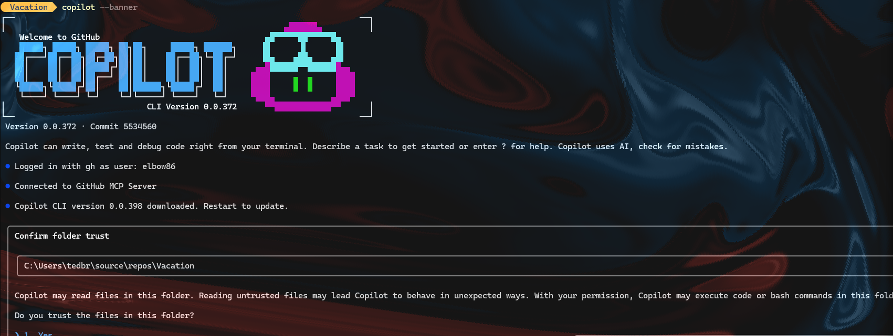

# January 29, 2026

As per James M's Youtube..
https://youtu.be/GsEPS1yHaHQ
 
Terminal, copilot --banner
cd to repo
and work away... cool

Video goes on to cover using the Copilot SDK to leverage the Copilot CLI to make apps

---
# MCP Apps

Lots of pain and fun.
Because Windows... had to change some things.
Some annoyances:  Husky slows down commits, so disabled it for now.

But cool to have UI for MCP apps.  (MCP Apps with UI)

Created 
- Game of Life
- Family Budget Tool
- Color Picker Tool

